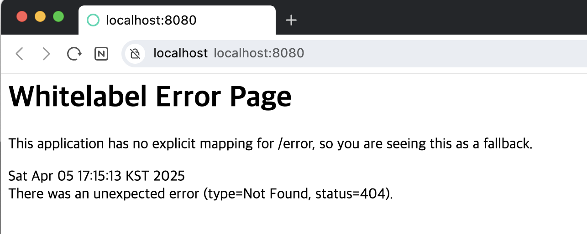

# 1주차 WIL

**주제**
- 웹과 HTTP
- 프론트엔드와 백엔드
- REST API

## 웹
여러 컴퓨터가 서로 연결되어 정보를 공유하는 공간
정보를 주고 받는 대표적인 모델이 '클라이언트 - 서버' 패러다임
- 클라이언트 : 데이터 좀 어케어케 CRUD 해주세요. 그리고 응답을 받음.
- 서버 : 요청대로 동작 수행하고 응답해주기.

클라이언트와 서버는 상대적인 관계라는 것도 이해해야해요.

## 프로토콜과 HTTP
컴퓨터가 데이터를 주고 받을 때 정해진 규칙, 규약.
따라서 프로토콜은 혼란스러운 일을 없애기 위해서 만들어진 것
- 아무튼 프로토콜은 네트워크안에서 요청과 응답을 보내는 규칙
- 웹에서는 HTTP라는 프로토콜을 사용

## HTTP 들여다보기
HTTP로 요청을 보낼 땐 _HTTP Method_, *URL*이 필요
- 메소드 : 데이터를 다루는 방법 (동사)
  - GET : 조회
  - POST : 생성
  - PUT : 수정 (전체 교체)
  - PATCH : 수정
  - DELETE : 삭제
- URL : 다룰 데이터의 위치 (목적어)

### POST vs PUT vs PATCH
데이터를 다루는 의도에 따라서 달라짐
- POST는 데이터를 서버에 생성해달라고 하는 내용. 계속 만들어주세요!
- PUT은 **데이터가 없으면 생성하고 있으면 대치**한다.
- PATCH는 **데이터가 있는데, 그 데이터 그대로 두고 일부를 바꾼다.**

-> 어떤 상황에서 어떤 메소드를 쓸 지 결정하는 지는 의도가 중요.

### URL 구조
URL : `http://www.example.com/user/1/nickname`
- `http://` : 프로토콜 scheme
- `www.example.com` : 서버 주소 domain
- `user/1/nickname` : 서버 내 데이터 위치 path

#### Path Parameter
URL의 path 부분에서 일반화된 표현 방법
`user/{user_id}/nickname` <- path 경로 내에서 변할 수 있는 값을 `{user_id}`처럼 일반화 해서 표현

#### Query String
request parameter라고 부르기도 한다.
URL의 path 뒤에 `?`를 쓰면 쿼리 스트링 시작한다.
`?` 이후에는 `{key=value}` 형식으로 쓰고 각각의 key, value 쌍을 `&`로 묶어준다.
`/search?page=1&keyword=hello` <- 검색할건데, 페이지는 1이고 키워드는 hello 였으면 좋겠어.

### HTTP로 주고 받는 데이터 구조
HTTP 데이터 = HTTP 헤더 + HTTP 바디
- 헤더 : 통신에 대한 정보 (언제, 누가, 어떤 메소드로, 요청 경로 등)
  - 응답을 보낼 때는 요청에 대한 결과를 나타내는 **상태코드**가 함께 한다.
- 바디 : 주고 받는 데이터 (보통 json 데이터)

## 프론트엔드와 백엔드
- 화면에는 매일 바뀌는 컨텐츠가 있다.
- 자주 변하지 않는 부분과 자주 변하는 부분을 분리해야했고 자연스럽게 프론트엔드와 백엔드로 역할이 분리하게 시작

## API
- HTTP는 단순 규칙, 구체적인 통신 방법을 규칙 안에서 직접 **정의**해야 하는데!
- Application Programming Interface
- 어플리케이션끼리 원하는 기능을 수행하기 위해 소통하는 방법(창구)를 **정의**한 것

### 백엔드 API
- 프론트가 백엔드에서 요청을 보낼 때, 어떤 메소드, url을 사용해야하는 지 정의한 것
- 각 요청에 대해 어떤 응답을 보내는 지 정의한 것

### REST API
- REST 아키텍처를 따르도록 설계한 API
- 쉽게 얘기하면
  - URL : 조작할 데이터 (명사)
  - HTTP method : 데이터에 대한 행위 (동사)

# API 명세
- 유저 회원가입 : `POST`
- 유저 로그인 : `POST`
- 나의 할 일 생성 : `POST`
- 나의 할 일 조회 : `GET`
- 나의 할 일 수정 : `PATCH`
- 나의 할 일 삭제 : `DELETE`
- 나의 할 일 체크 : `POST`
- 나의 할 일 체크 해제 : `POST`
- 친구 찾기 : `GET`
- 팔로우 : `POST`
- 언팔로우 : `POST`
- 나의 친구 리스트 조회 : `GET`
- 특정 친구의 할 일 조회 : `GET`

# whitelabel

