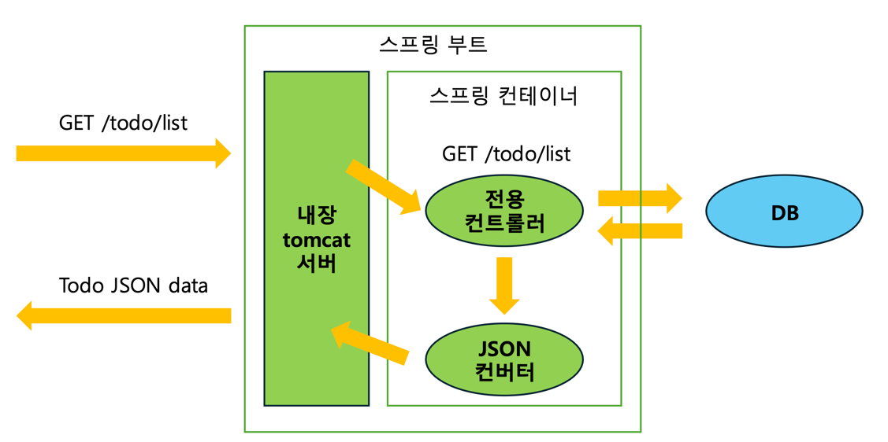
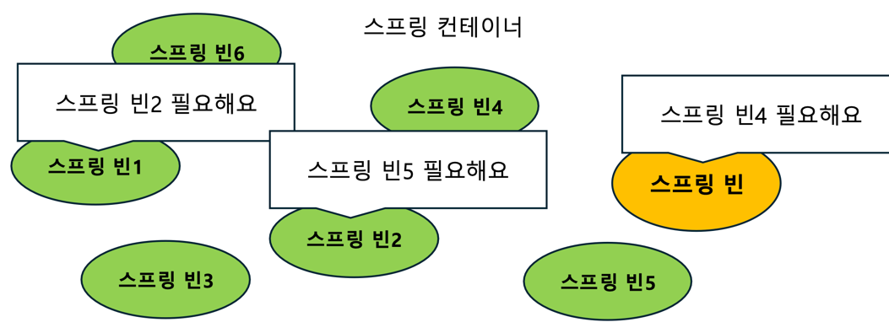
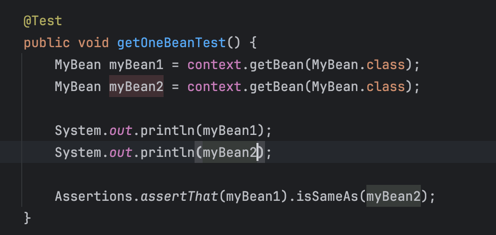
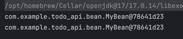
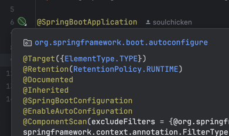
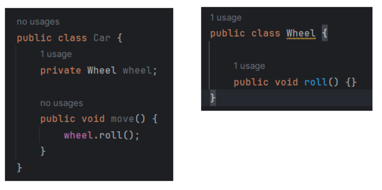
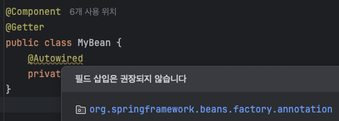
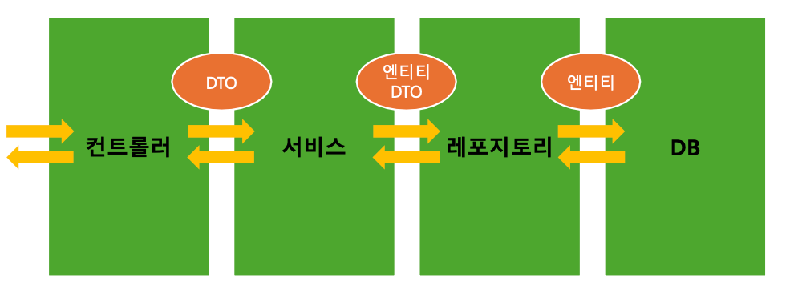
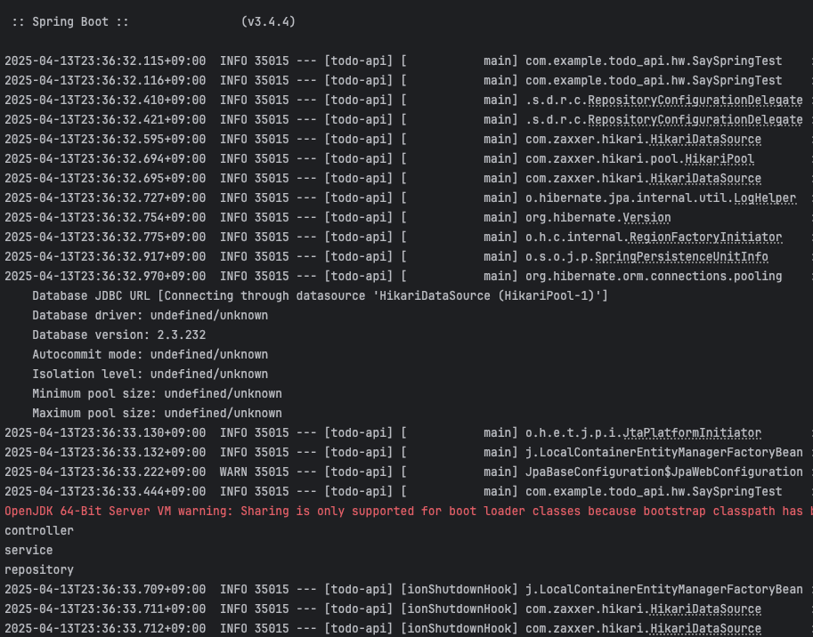

# 2주차 WIL

**이번 주에 공부할 내용**
- 스프링 빈과 스프링 컨테이너의 개념
- 스프링 컨테이너에 빈을 저장하는 방법
- 스프링 컨테이너에서 빈을 받아오는 방법

## 스프링
- JAVA 대표 백엔드 프레임워크
- **객체지향 원칙**을 지켜주는 친구 (인프런 김영한님 강의 추천 추천)

## 스프링 부트
- 스프링 프레임워크를 사용하여 개발할 때, 더 편하게 해주는 친구
- 스프링으로 개발할 때 함께 사용
- 내장 웹서버도 있어서 정말정말 편해요.

## 스프링 어플리케이션 구조


## 스프링 빈(Bean)
- 어플리케이션 전역에서 사용할 공용 **객체** (재사용하게 됨 / 단 하나만 있음!)
- 스프링 컨테이너라고 하는 공용 창고에서 빈(객체)을 저장해두고, 필요한 빈을 컨테이너에서 받아 사용한다.
- 필요한 빈은 스프링 프레임워크가 자동으로 가져다 준다.
- 이때 **빈을 요구하는 객체도 스프링 빈**이다. (빈이 아닌 객체가 빈을 요구해도 프레임워크가 자동으로 가져다주지는 못한다.)
  - 즉, 빈을 사용하는 주체 역시 빈이므로 서로가 서로를 필요로 하는 구조로 되어 있다.



## 스프링 컨테이너
- 스프링 빈이 저장되는 공간
- 어플리케이션 컨텍스트(Application Context)라고도 부른다.

## 스프링 빈을 컨테이너에 저장하는 2가지 방법
- 설정 파일 작성 (수동 등록)
- 컴포넌트 스캔 (자동 등록) ➡️ 클래스에다가 빈으로 등록해달라고 하는 표식을 함

### 설정 파일 작성
- 설정 파일은 **자바 클래스**로 작성
- 설정용 자바 클래스에 `@Configuration` 으로 설정 파일임을 명시

### 정말 빈은 재사용해서 같은 객체를 사용하는가
**테스트 코드**  

**출력 결과**  


그렇다.

### 컴포넌트 스캔 방식
- 빈을 생성할 클래스에 `@Component` 어노테이션 사용
- 어플리케이션을 실행할 때 `@Component`가 붙은 클래스를 찾아서 자동 등록
- 테스트 : 컴포넌트 스캔시에는 `@ComponentScan` 어노테이션 사용

### config가 꼭 필요한가

어플리케이션이 실행될 때 이미 `@SpringBootApplication`로 스캔을 한다.

## 의존성 주입 (Dependency Injection, DI)
_내가 의존하는 객체를 직접 생성하지 않고 밖에서 주입 받는 것_

앞선 스터디 내용에서는 직접 컨테이너에서 빈을 꺼내오는 느낌으로 사용했지만
빈을 실제로 사용할 때에는 프레임워크에게 **필요한 빈(의존성)을 요청**하고 받아서 사용한다. (주입? 받는다?)

### 의존성 개념
- 자동차가 움직이려면 바퀴가 필요하다. `===` 자동차는 바퀴에 의존한다.
- A의 기능을 실행하는 데에 있어 B의 기능이 필요하다면 **'A는 B에 의존한다'** 라고 한다.

- `Car` 객체의 `move()` 메소드를 실행하려면 `Wheel` 객체가 필요하다.

### 따라서 의존성 주입이란
- 스프링에서는 컨테이너에 저장된 빈(객체)과 빈(객체)사이의 의존성을 프레임워크가 주입하는 것을 말한다.
- 빈이 아닌 객체에 빈을 자동으로 주입할 수는 없다. 스프링이 빈을 주입하려면, 두 객체 모두 스프링에 의해 관리 (=빈으로 등록) 되어야 하기 때문이다.
- 객체를 스프링 빈으로 등록한다. === 공동 창고(컨테이너)에 빈을 넣겠다. === 프레임워크에게 객체를 관리하도록 위임하겠다.

### 의존성을 주입 받는 이유
스프링 프레임워크가 만들어진 이유와 밀접하게 연관된다.
- 객체 지향 원칙 중 하나인 **OCP(Open Close Principle)** 원칙을 준수한다. (필요한 객체를 내가 하드코딩하지 않기 때문에 **유지보수**하기 좋아진다)
  - OCP 원칙 : 변경에는 `close`, 확장에는 `open`하는 원칙.
- 매번 필요한 객체를 생성하는 대신, 생성해둔 객체를 사용하므로 **메모리를 효율적**으로 사용할 수 있다.

### 의존성 주입 방법
- 어떤 객체에 다른 객체를 주입하는 **통로**를 만들어야한다. (크게 생성자, 필드, 메서드 3가지가 존재한다.)
- 통로를 만들고 이 통로를 통해 **주입해달라는 표시** (`@Autowired` 어노테이션)를 해준다.  

**주입 방법 1 - 생성자 주입 (`@Autowired`)**
- 가장 자주 사용하는 의존성 주입 방법
- 의존성이 바뀔 일이 없는 경우 안전하게 `final`로 선언 (const 같은 것)
- 이때 final 필드는 생성자를 통해 초기화되어야 한다.
- 생성자에 `@Autowired` 어노테이션을 사용해서 빈을 주입한다. (만약 클래스에 생성자가 하나만 있다면 `@Autowired`를 생략할 수 있다.)
- (Lombok이 제공하는 어노테이션인) `@RequiredArgsConstructor`를 통하면 모든 `final` 필드에 대한 생성자를 자동으로 만들어준다. 생성자 코드를 생략할 수 있다!

```java
// 일반적인 생성자 주입 방법
@Component
@Getter
public class MyBean {
    private final MySubBean mySubBean;

    // 생성자가 하나라서 @Autowired를 생략할 수 있다.
    @Autowired
    public MyBean(MySubBean mySubBean) {
    }
}

// @RequiredArgsConstructor를 사용하는 방법
@RequiredArgsConstructor
public class MyBean {
  private final MySubBean mySubBean;
}
```

**주입 방법 2 - 필드 주입**
- 필드에 바로 `@Autowired` 어노테이션을 사용한다. 이때 `final` 키워드 사용 불가능하다.
- 이 방식은 주로 **테스트코드**에서 사용하며 운영 코드에서 사용하면 IDE에서 경고를 띄운다.
- `@SpringBootTest` : 테스트 실행 전에 스프링 부트를 실행시켜서 모든 빈을 컨테이너에 넣어놓으라는 테스트용 어노테이션. 스프링 부트를 실행시키므로, **통합 테스트**에서도 사용할 수 있다.
```java
@Component
@Getter
public class MyBean {
    @Autowired
    private MySubBean mySubBean;
}
```



```java
// 테스트 코드
@SpringBootTest
public class BeanTest2 {

  @Autowired
  private MyBean myBean;

  @Autowired
  private MySubBean mySubBean;

  @Test
  public void dependencyInjectionTest() {
    System.out.println(myBean.getMySubBean());
    System.out.println(mySubBean);

    Assertions.assertThat(myBean.getMySubBean()).isSameAs(mySubBean);
  }
}
```

## 스프링 빈 활용
_빈과 컨테이너를 실제 개발에서는 어떻게 활용할까?_   
스프링 어플리케이션을 개발할 때 어떤 구조로 하게 될까?

### Spring Layered Architecture



주로 사용하는 이 레이어드 아키텍처는 계층 구조를 갖는다.  
컨트롤러부터 레포지토리는 스프링의 영역이라고 생각하면 된다.

**컨트롤러**
- 클라이언트의 요청을 받고, 응답을 보내는 계층
- DTO(Data Transfer Object)를 사용하여 서비스 계층과 데이터를 주고 받는다.


**서비스**
- 어플리케이션의 비즈니스 로직이 담기는 계층
- 레포지토리 계층과 소통하며 엔티티, 또는 DTO로 데이터를 주고 받는다.

**레포지토리**
- DB와 소통하며 데이터를 조작하는 계층
- 서비스 계층이 결정한 비즈니스 로직을 실제 DB에 적용한다.


# 숙제

