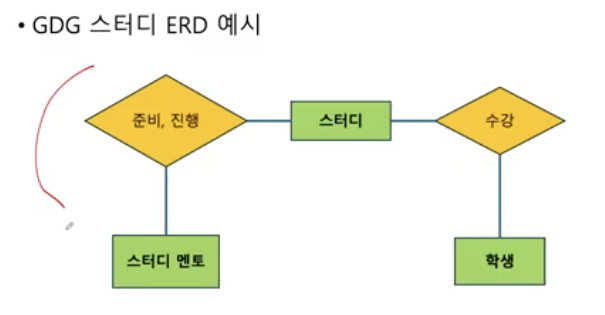
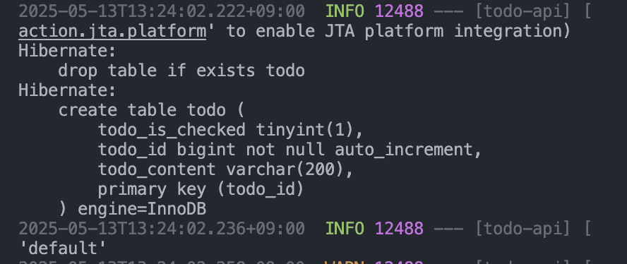

# 3주차 WIL

## 숙제
### ERD


### 테이블 생성


## 지난 주
지난 주는 스프링 빈과 컨테이너에 대해서 다뤘다.
의존성 주입 : 필요한 객체(빈)을 컨테이너에서 꺼내서 주입

- 빈 저장하기 : 설정 파일 / 컴포넌트 스캔
- 테이너에서 빈 주입 : 생성자 주입 / 필드 주입

- 레이어드 아키텍처 : 컨트롤러 - 서비스 - 레포지토리 - DB

➡️ 이번 주 목표 : DB를 설계하고 JPA를 통해 DB 구현하기
따라서 본격적인 TODO Mate API를 만들어볼 예정

## DB 설계
문제 상황을 개체(엔티티)와 그 사이의 관계로 추상화한다.
- 개체(Entity) : 문제 상황을 구성하는 요소
- 관계(Relationship) : 개체와 개체 사이의 관계

### ER Model (Entitiy-Relationship Model)
- ERD: ER Model을 다이어그램으로 나타낸 것


### 속성 (Attribute)
- 사람 개체는 이름, 나이 속성을 가질 수 있다.
- 하나의 개체를 식별할 수 있는 속성을 PK(Primary Key)라고 한다.

### ER Model -> DB 구현
- **개체** -> **테이블**
- **관계** -> 테이블 or **외래키**
- **속성** -> **테이블 컬럼**

### ERD 그리기
- [ERD 클라우드](https://www.erdcloud.com/) 고고

1. User, Todo 테이블을 만든다.


2. User와 Todo의 관계를 정의한다.
   관계는 N:1, 1:1, N:M이 있다.
   1명의 유저는 여러 개의 할 일을 생성할 수 있다.
   따라서 유저와 할 일의 관계는 1:N 관계를 갖는다.
   -> **1:N 관계는 외래키로 구현한다.** (비식별 관계로 해주자)


### 팁
1. 식별 vs 비식별

식별 관계 : 관계 대상의 PK를 자신의 PK로도 사용하는 것
비식별 관계 : 관계 대상의 PK를 자신의 FK로만 사용하는 것

2. N:M 관계

회원은 여러 동아리에 소속될 수 있다.
동아리도 여러 회원을 가질 수 있다.
따라서 회원과 동아리는 N:M이다.

구현할 때에는 N:M을 직접 구현하는 것이 아니라 중간 테이블을 만들어서 1:N, M:1 관계로 쪼개서 구현한다.

3. 관계는 같은 엔티티에서도 가능하다.

user-user 사이의 친구라는 관계를 만들 수 있다.

## JPA로 ERD 구현하기
- JPA : Java Persistence API
- 데이터베이스에서 읽어온 데이터를 자바 객체로 매핑하는 자바의 표준 기술 (ORM)
- 엔티티는 JPA에서 자바와 데이터베이스가 소통하는 단위로 테이블의 데이터 하나는 엔티티 객체 하나로 매핑된다.
- 엔티티 클래스를 정의하면 JPA가 알잘딱으로 SQL 말아서 테이블을 만들고 CRUD를 도와준다.

### 라이브러리 세팅
- DB는 H2를 사용하며, 관련 라이브러리는 1주차에 생성할 때 이미 받아놨다.
- JPA는 외부 라이브러리가 필요한데, 1주차에 생성할 때 이미 받아놨다.

```
dependencies {
	implementation 'org.springframework.boot:spring-boot-starter-data-jpa'
	implementation 'org.springframework.boot:spring-boot-starter-web'
	compileOnly 'org.projectlombok:lombok'
	runtimeOnly 'com.h2database:h2'
	annotationProcessor 'org.projectlombok:lombok'
	testImplementation 'org.springframework.boot:spring-boot-starter-test'
	testRuntimeOnly 'org.junit.platform:junit-platform-launcher'
}
```

### application.yml <-application.properties
기존에 있는 `properties` 파일을 `yml` 파일로 바꿔주자.

**BEFORE [application.properties]**
```
spring.application.name=todo-api
```

**AFTER [application.yml]**
```
spring:
  application:
    name: todo-api
```

### yml 파일에 DB 정보 추가
```
spring:
  application:
    name: todo-api
  
  datasource:
    url: jdbc:h2:mem:todo;MODE=MYSQL
  
  h2:
    console:
      enabled: true
    
  jpa:
    show-sql: true
    properties:
      hibernate:
        format_sql: true
        dialect: org.hibernate.dialect.MySQL8Dialect
```

- 스프링 부트는 기본적으로 H2 in-memory DB를 사용
- H2 데이터베이스를 MYSQL처럼 사용하도록 MODE 적용
- DB에 저장된 데이터를 볼 수 있도록 관리자 콘솔을 활성화하고 관리자 콘솔에 접속할 URL 명시
- JPA를 디버깅하기 위해서 `show-sql` 옵션을 `true`로 만든다.
  - `format_sql`까지 적용하면 들여쓰기까지 예쁘게 나옴

## h2 DB 접근
스프링 부트를 실행하고 `http://localhost:8080/h2-console/`를 들어가면 나온다.


### h2랑 스프링 연결


## 테이블 만들기
todo 패키지에 엔티티용 Todo 클래스를 만든다.

`Entity` 클래스는 무조건 `id`(PK)가 필요하다. (`@Entity` 어노테이션이 필요하다.)
- `Long` 타입은 MySQL의 `BIGINT`와 닿아있다.
- 어노테이션으로 `@Id`가 필요하고, DB에 자동으로 1씩 증가하면서 넣기 위해서 `@GeneratedValue` 어노테이션에 전략은 `GenerationType.Identity`를 사용한다.

```java
@Entity
public class Todo {
    
    @Id
    @GeneratedValue(strategy = GenerationType.IDENTITY)
    private Long id;
    private String content;
    private boolean isChecked;
} 
```

ERD는 **스네이크 케이스**, 자바에서는 **카멜 케이스**로 명명한다.

실행하면 아래처럼 테이블이 만들어지는 쿼리가 날라가는걸 볼 수 있다.


H2에 접속해보면 테이블이 만들어진 것도 확인할 수 있다.


### 컬럼명을 스네이크 케이스로 바꾸기
지금의 컬럼명은 자바의 카멜케이스로 되있다. 이름을 바꿔보자.
- `@Column(name = "컬럼명")`을 사용한다.
```java
    @Id @GeneratedValue(strategy = GenerationType.IDENTITY)
    @Column(name = "todo_id")
    private Long id;

    @Column(name = "todo_content")
    private String content;

    @Column(name = "todo_is_checked")
    private boolean isChecked;
```

만약 `todo_content`를 `varchar(200)`으로 바꾸고 싶다면 이렇게 `@Column`에 `columnDefinition`을 추가한다.
이와 같이 `isChecked`도 ERD처럼 만들어주자.
```java
    @Column(name = "todo_content", columnDefinition = "varchar(200)")
    private String content;

    @Column(name = "todo_is_checked", columnDefinition = "tinyint(1)")
    private boolean isChecked;
```

테이블이 DROP됐다가 다시 생성되면서 컬럼명과 데이터 타입이 잘 들어맞아졌다.


## user 테이블과 외래키로 연결하기
JPA는 엔티티에서 외래키 컬럼을 만들 때는 Long 타입의 외래키 필드 대신, 해당 엔티티 타입의 객체를 필드로 가져오도록 설계한다.

### member 테이블 만들기
member 패키지를 만들고 Member 클래스를 만든다.
- user가 아니라 member인 이유는 DB에 있는 users와 혼동을 없애기 위함

```java
@Entity
public class Member {
    @Id @GeneratedValue(strategy = GenerationType.IDENTITY)
    @Column(name = "member_id")
    private Long id;

    @Column(name = "member_email", columnDefinition = "varchar(20)")
    private String email;

    @Column(name = "member_password", columnDefinition = "varchar(30)")
    private String password;
}
```

테이블이 만들어졌다.


### 외래키 연결하기

```java
    @JoinColumn(name = "member_id")
    @ManyToOne(fetch = FetchType.LAZY)
    private Member member;
```

- `@JoinColumn(name = "member_id")` : 어노테이션으로 조인할 외래키 컬럼을 지정한다.
- `@ManyToOne(fetch = FetchType.LAZY)` : `1:N` 관계라는 뜻
  - **OneToOne**, OneToMany, ManyToMany도 있다.
  - OneToMany는 양방향 맵핑으로 작용한다. 스터디에서는 단방향 맵핑만 사용할 예정
  - ManyToMany는 N:M관계인데, 외래키 대신 **테이블로 구현**하므로 사용하지 않는다.
- fetchType을 Lazy로 지정했는데, 엔티티를 언제 가져올 것인지를 명시하는 부분이다.


EAGER는 한번에 가져와서 편해보이지만 필요하지 않은 정보까지 줄줄이 가져오게 되기에 쓰지 않는 편이 좋다.

### Todo 엔티티의 생성자 만들기
모든 엔티티 클래스는 아무런 인자가 없는 `public` 또는 `protected` 생성자가 꼭 기본적으로 필요하다.
그렇지만 `Lombok`의 `@NoArgsConstructor`로 만들어줄 수 있다.
이때 만들어지는 생성자는 `public`이기 때문에 `PROTECTED`로 바꿔주자.
`Getter`까지 달아줘서 나중에 필드 접근을 열어주기.
```java
@Entity
@Getter
@NoArgsConstructor(access = AccessLevel.PROTECTED)
public class Todo {
    
        public Todo(String content, boolean isChecked, Member member) {
        this.content = content;
        this.isChecked = isChecked;
        this.member = member;
    }
```

필요에 따라서 `@Builder` 어노테이션으로 빌더 패턴을 사용할 수도 있다.
