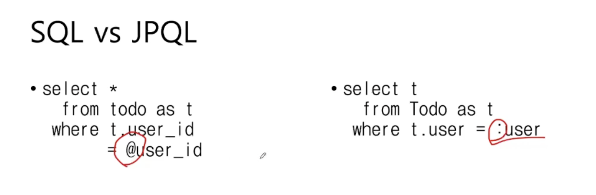

# WEEK 4

## 지난 주 내용
- ERD, JPA, Entity

## 이번 주
- JPA를 사용해서 테이블 데이터를 CRUD

## 레포지토리 계층
- DB와 소통하며 데이터를 조작하는 계층 (CRUD)
- 서비스 계층이 결정한 비즈니스 로직을 DB에 적용
- CRUD는 **JPA가 제공하는 기능**을 이용해서 구현
    - Read는 SQL 문법을 조금 써야함

## 엔티티 매니저
JPA는 application.yml 정보를 통해 Entity Manager 생성
- 엔티티 매니저는 우리 대신 DB와 직접 소통하는 객체
  - 생성한 엔티티 객체를 DB에 추가
  - DB에 조회한 데이터를 엔티티 객체로 만들기
  - 엔티티 객체에 대한 수정, 삭제를 DB에 반영

## 트랜잭션
- JPA 또한 DB와 유사하게 트랜잭션 단위로 동작
- 데이터베이스에 가하고 싶은 변경 묶음
- 쓰기 지연이라고도 함. 운명 공동체
- 트랜잭션이 끝나면 모든 변경 사항을 DB에 반영 (커밋)
- 트랜잭션 중간에 에러가 발생하면 모든 변경점을 되돌림 (롤백)
  - 만약 회원 가입과 쿠폰 발급이 두 번 다 실행되야 한다면, 쿠폰 발급이 취소되면 가입도 취소시켜버림!

## 영속성 컨텍스트
- DB에 조회한 엔티티를 캐싱하는 공간
- JPA가 DB에 반영할 엔티티의 모든 변경 사항 보관 (일종의 버퍼 공간)
- 엔티티 변경사항을 영속성 컨텍스트에 저장했다가 트랜잭션 커밋시 DB에 반영되도록 **일괄** SQL 생성
- 조회시 DB에 쿼리를 보내서 영속성 컨텍스트로 가져오고 캐싱을 한다. 2번 조회를 하면 **캐싱된 데이터를 가져오기에 쿼리를 날리지 않는다.** 또한 가져온 객체는 영속성 컨텍스트에서 제공하는 **동일한 객체**다.
- 변경 감지 : 엔티티를 수정했을 때, 트랜잭션을 처리하는 과정에서 컨텍스트 안에 수정된 정보를 비교하고 SQL 생성

## 레포지토리 계층 만들기

### TodoRepository 클래스 생성
`todo` 패키지에 `TodoRepository` 클래스를 추가하고 `@Repository` 어노테이션 달아준다.
- (빈 등록을 위해 사용하는 `@Component`의 기능을 갖고 있다!)


```java
package com.example.todo_api.todo;

import org.springframework.stereotype.Repository;

@Repository
public class TodoRepository {
    // 데이터 생성

    // 데이터 조회

    // 데이터 수정

    // 데이터 삭제
}

```

### 엔티티 매니저
`application.yml` 파일을 읽고 내부에 엔티티 매니저를 알아서 만들어준다.

```java
@PersistenceContext
private EntityManager em;
```

### 데이터 생성
- `em.persist(객체)` : 객체를 영속성 컨텍스트에 넣어주라는 뜻
- 트랜잭션 커밋할 때 영속성 컨텍스트와 DB가 동기화되면서 DB에 데이터 추가

```java
    public void save(Todo todo) {
        em.persist(todo);
    }
```

### 테스트 코드를 만들어기
`todo` 패키지에 `TodoRepositoryTest` 만들기


`@SpringBootTest` 어노테이션을 사용해서 Spring Boot 테스트 코드를 실행시킬 환경을 만들고 `@Autowired`로 `TodoRepository` 빈을 주입한다.

```java
package com.example.todo_api.todo;

import org.springframework.beans.factory.annotation.Autowired;
import org.springframework.boot.test.context.SpringBootTest;

@SpringBootTest
public class TodoRepositoryTest {
    
    @Autowired
    private TodoRepository todoRepository;
}
```

### 로컬에서 실행한 것 같은 테스트 환경 만들기
어노테이션에 실제 8080 포트에서 돌아갈 수 있도록 세팅한다.
```java
@SpringBootTest(webEnvironment = SpringBootTest.WebEnvironment.DEFINED_PORT)
```

### 데이터 생성 테스트 코드 만들기
트랜잭션 어노테이션을 넣으면 매소드가 완료되야 트랜잭션이 종료되면서 커밋이 된다. 아니면 롤백! AOP같은걸로 되는듯 하다.
```java
    @Test
    @Transactional // 트랜잭션을 반드시 사용해서 테스트 해야한다.
    void todoSaveTest() {
        // 트랜잭션의 시작
        Todo todo = new Todo("todo content", false, null);
        todoRepository.save(todo);

        // 트랜잭션 종료 & 커밋
        // 에러가 발생하면 자동 롤백
        Assertions.assertThat(todo.getId()).isNotNull();
    }
```

### 문제가 있다. 우리가 사용하는 H2 데이터베이스는 인메모리 데이터베이스다.
- 따라서 코드가 종료되면 DB가 사라진다.

테스트 코드가 전부 종료되면 while문으로 무한 루프를 돌아서 코드 종료를 하지 못하게 하자.
```java
    @AfterAll
    public static void doNotFinish() {
        System.out.println("테스트 종료");
        while (true) {}
    } 
```

테스트 코드는 끝났지만 while문으로 무한 루프를 돌고 있다.
이제 DB에 들어가서 확인해보자.


없다.

### 테스트 결과 롤백이 된거 같다 -> `@Rollback(false)`
테스트 환경 기준으로는 에러가 발생하지 않아도 테스트 종료시 자동 롤백이 된다.
수동으로 롤백하지 말라고 어노테이션을 달아주자.
```java
@Test
@Transactional // 트랜잭션을 반드시 사용해서 테스트 해야한다.
@Rollback(false) // 롤백을 하지 않도록 설정
void todoSaveTest() {
    // 트랜잭션의 시작
    Todo todo = new Todo("todo content", false, null);
    todoRepository.save(todo);

    // 트랜잭션 종료 & 커밋
    // 에러가 발생하면 자동 롤백
    Assertions.assertThat(todo.getId()).isNotNull();
}
```

드디어 들어갔다!


## 할 일 조회
- 단건 조회 (todo_id를 기준으로 데이터 하나만 조회) : `em.find(Todo.class, id값)`
- 다건 조회
- 조건 조회

### 조회 코드
```java
    // 단건 조회 (1개 데이터)
    public Todo findById(Long id) {
        return em.find(Todo.class, id);
    }
```

### 테스트 코드 (영속성 컨텍스트에서 가져오기)
테스트 코드는 given (조건), when (행위), then (결과) 순으로 작성한다.
- findById로 Todo 데이터를 가져오게 되면 DB에서 직접 조회하는 것이 아니라 영속성 컨텍스트에 넣어놓은 데이터를 가져온다.
```java
    // 조회
    @Test
    @Transactional
    void todoFindByIdTest() {
        // given
        Todo todo = new Todo("todo content", false, null);
        todoRepository.save(todo);

        // when
        Todo findTodo = todoRepository.findById(todo.getId());

        // then
        Assertions.assertThat(findTodo.getContent()).isEqualTo("todo content");
    }
```

### SQL로 직접 확인해보기 위해 TodoRepository에 메소드 추가
- TodoRepository에 이런 코드를 추가하자
```java
    // TEST 용도로만 사용하기
    public void flushAndClear() {
        em.flush(); // 영속성 컨텍스트의 내용을 전부 DB에 반영하라
        em.clear(); // 영속성 컨텍스트 비워라
    }
```

### 테스트 코드 2 (DB에서 확인하기)
```java
    // 조회
    @Test
    @Transactional
    void todoFindByIdTest() {
        // given
        Todo todo = new Todo("todo content", false, null);
        todoRepository.save(todo);
        todoRepository.flushAndClear(); // 영속성 컨텍스트 초기화

        // when
        Todo findTodo = todoRepository.findById(todo.getId());

        // then
        Assertions.assertThat(findTodo.getContent()).isEqualTo("todo content");
    }
```

**테스트 결과!**


## 할 일 전체 조회
쿼리를 작성해야한다. (엔티티 매니저로는 findAll 기능이 없다.)
- 정확하게는 SQL이 아니라 JPQL로 작성한다.
```java
    // 다건 조회
    public List<Todo> findAll() {
        // JPQL 사용
        return em.createQuery("SELECT t FROM Todo t", Todo.class)
                .getResultList();
    }
```

### 할 일 전체 조회 테스트 코드
`flushAndClear`를 안해도 DB의 전체 내용이 영속성 컨텍스트에 있는 지 모르기 때문에 SQL 조회를 하게 된다.

```java
    // 다건 조회
    @Test
    @Transactional
    void todoFindAllTest() {
        // given
        Todo todo1 = new Todo("todo content1", false, null);
        Todo todo2 = new Todo("todo content2", false, null);
        todoRepository.save(todo1);
        todoRepository.save(todo2);

        // when
        List<Todo> todos = todoRepository.findAll();
        System.out.println(todos);

        // then
        Assertions.assertThat(todos).hasSize(2);
    }
```

## 할 일 조건 조회
WHERE 절을 사용한다.
```java
    // 조건 조회 (WHERE 절을 사용)
    public List<Todo> findAllByMemberId(Member member) {
        return em.createQuery("SELECT t FROM Todo t WHERE t.member = :todo_member", Todo.class)
                .setParameter("todo_member", member)
                .getResultList();

    }
```

### 멤버 레포지토리 작성
조건 조회를 위해 멤버가 필요하다.

```java
package com.example.todo_api.member;

import org.springframework.stereotype.Repository;

import jakarta.persistence.EntityManager;
import jakarta.persistence.PersistenceContext;

@Repository
public class MemberRepository {
    
    @PersistenceContext
    private EntityManager em;

    public void save(Member member) {
        em.persist(member);
    }
}
```

### 할 일 조회 테스트 코드
```java
    // 조건 조회
    @Test
    @Transactional
    void todoFindAllByMemberTest() {

        // given
        Member member1 = new Member("member1@gdg.com", "password1");
        Member member2 = new Member("member2@gdg.com", "password2");
        memberRepository.save(member1);
        memberRepository.save(member2);

        Todo todo1 = new Todo("todo content1", false, member1);
        Todo todo2 = new Todo("todo content2", false, member1);
        Todo todo3 = new Todo("todo content3", false, member2);
        todoRepository.save(todo1);
        todoRepository.save(todo2);
        todoRepository.save(todo3);

        // when
        List<Todo> member1Todos = todoRepository.findAllByMember(member1);
        List<Todo> member2Todos = todoRepository.findAllByMember(member2);

        // then
        Assertions.assertThat(member1Todos).hasSize(2);
        Assertions.assertThat(member2Todos).hasSize(1);
    }
```

## SQL vs JPQL



## 할 일 수정
- 트랜잭션 안에서 객체를 수정하면 트랜잭션이 끝날 때 반영된다.

### Todo 필드에 접근할 수 있도록 열어주기
```java
class Todo {
    ...
    public void updateContent(String newContent) {
        this.content = newContent;
    }
    ...
}
```

### 할 일 수정 테스트 코드
```java
    // 데이터 수정
    @Test
    @Transactional
    @Rollback(false)
    void todoUpdateTest() {
        Todo todo = new Todo("todo content", false, null);
        todoRepository.save(todo);
        todoRepository.flushAndClear(); // 영속성 컨텍스트 초기화

        Todo findTodo = todoRepository.findById(todo.getId());
        findTodo.updateContent("new content");
    }
```


## 할 일 삭제
```java
    public void deleteById(Long id) {
        Todo todo = findById(id);
        em.remove(todo);
    }
```

### 테스트 코드
```java
    // 데이터 삭제
    @Test
    @Transactional
    @Rollback(false)
    void todoDeleteTest() {
        Todo todo = new Todo("todo content", false, null);
        todoRepository.save(todo);
        todoRepository.flushAndClear(); // 영속성 컨텍스트 초기화

        todoRepository.deleteById(todo.getId());
        Todo findTodo = todoRepository.findById(todo.getId());

        Assertions.assertThat(findTodo).isNull();
    }
```

